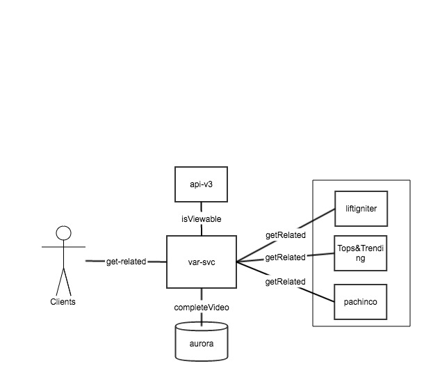
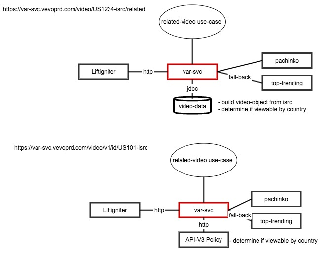

var-svc
=======
Video-Artists Related service

## Summary:

var-svc end points provide related-videos and related-artist-videos by providing a facade for the related video & artists backend Recommendation systems:

- liftigniter
- pachinco
- tops and trending

## Service URLs:



#### Status-url

This endpoint is used by kubernetes to determine services health status.
status-end point provides: 

- healthstatus
- application build and version related info
- status of database connection

```
curl https://var-svc.vevostg.com/status
{
builtAtMillis: "1490211416441",
name: "var-svc",
scalaVersion: "2.11.8",
buildInfoBuildNumber: "3",
version: "1.0",
sbtVersion: "0.13.13",
builtAtString: "2017-03-22 19:36:56.441"
}
```

```
curl https://var-svc.vevostg.com/status/db

gocdPipelineCounter: "39",
aurora-database-isUp: true,
builtAtMillis: "1490211416441",
name: "var-svc",
scalaVersion: "2.11.8",
buildInfoBuildNumber: "3",
version: "1.0",
sbtVersion: "0.13.13",
builtAtString: "2017-03-22 19:36:56.441"
}
```
#### Related-videos-url

The API provides related videos as isrc, video-ids, only or a complete video object
This endpoint provides related assets, videos, for the provided asset-id, isrc.  

### video ids only url

```
curl https://var-svc.vevostg.com/video/v1/ids/QMGR31635754\?token\=AcwGM8nU7zMC8YHaFhu1hhsSlBl3xBS29zLm7poRO2U3d3HyENS6uqT1UmUiEPq22AXgvUF1LiKoQKBotGfw0sg7uAW9OWap5HZZ1CGoJ1vcTqjUFbCw3GR6mLp85-rqVw
```
[response-payload](https://github.com/VEVO/var-svc/blob/master/docs/related-video-isrc-response.json)

### Fetch complete video-object url

```
curl http://localhost:9000/video/QMGR31635754/related?token=AcwGM8nU7zMC8YHaFhu1hhsSlBl3xBS29zLm7poRO2U3d3HyENS6uqT1UmUiEPq22AXgvUF1LiKoQKBotGfw0sg7uAW9OWap5HZZ1CGoJ1vcTqjUFbCw3GR6mLp85-rqVw
```
[response-payload](docs/related-video-response.json)


### Related-artists

This endpoint is under development

## Detail

var-svc provides a facade for the related video & artists backend systems:

- Liftigniter
- pachinko
- tops and trending

## Local development

- clone the repository
- set up required environment variables. These variables are of the format ```${}``` in [application.conf](src/main/resources/application.conf)
- use the following command lines to build, test & run your project

#### Requirements

* JDK 1.8
* Scala 2.11.7+
* Scalaz 2.7.2
* sbt 13.11

#### setup
```
git clone https://github.com/VEVO/var-svc
sbt clean compile  // to build prject
sbt test // unit test
sbt it:test // integration test
sbt clean compile universal:packageBin // to generate an executable
sbt clean compile docker:publishLocal
```

You may also run the project as a docker image following the docker -run instructions


### Project related links

[Liftigniter API](https://vevowiki.atlassian.net/wiki/display/PTENG/LiftIgniter)

[datadog](https://app.datadoghq.com/dash/259573/var-svc?live=true&page=0&is_auto=false&from_ts=1489441606869&to_ts=1489445206869&tile_size=m)

[gocd](https://gocd.vevodev.com/go/tab/pipeline/history/var-svc)

[docker](https://hub.docker.com/r/vevo/var-svc/)

### References

[doobie-persistence](https://tpolecat.github.io/doobie-0.2.0/01-Introduction.html)

[http4s](http://http4s.org/)

[circe-json](https://circe.github.io/circe/parsing.html)


